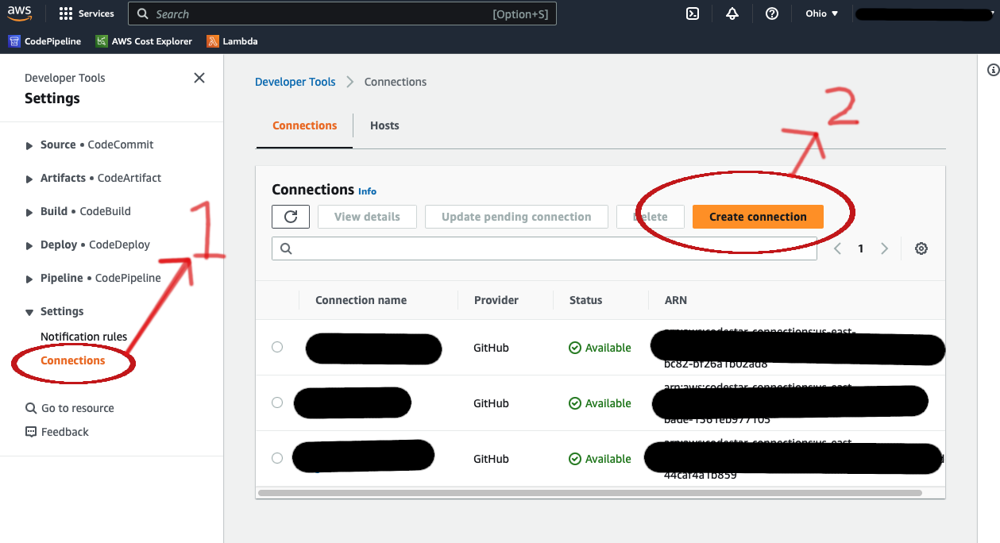

# aws-cdk-django


## Infrastructure

### Steps to create the aws cdk app
1.- Create the remote repository
2.- Clone the repository, create an empty folder, move into this one and create the aws template
```bash
git clone git@github.com:ale180192/aws-cdk-django.git
cd aws-cdk-django/
mkdir infrastructure
cdk init app --language python --generate-only
```
3.- Create your virtual environment to the aws cdk app, we are going to create this one at the root folder, and we will install the python dependencies.
```bash
cd ..
python3 -m venv .venv-cdk
source .venv-cdk/bin/activate
pip install --upgrade pip
pip install -r infrastructure/requirements.txt
```

4.- Validate our app is ok
- fist al all we need to configurate our aws credentials(Install the aws cli, run `aws configure sso`). See the aws docs
- We move on into the infrastructure folder `cd infrastructure`
- Synth our app with `cdk synth --profile <your aws profile>`

5.- That's it, we already our aws cdk app configured.


### Makes boostrap to our app.
For this aws cdk app we need to have 3 aws sub accounts, pipeline, sandbox and production account. [See the aws docs of the Identity Center](https://aws.amazon.com/es/iam/identity-center/)

The process of bootstrapping in AWS CDK refers to the initial setup required to use CDK in an AWS account. It involves creating a CloudFormation stack called "CDKToolkit" in the AWS account, which is responsible for storing and managing the necessary resources to execute and manage CDK applications.

During the bootstrapping process, an Amazon S3 bucket is created in the AWS account to store CDK deployment artifacts, and an IAM role is established to allow CDK to perform operations in the account.

We also bootstrap the sandbox account and the production account. In general, we will create a pipeline that will be deployed on the tools account. This pipeline will deploy to both the sandbox account and the production account. Through the bootstrap process, we grant the necessary permissions to enable deployments to multiple accounts.

Our 3 aws accounts are:
* pipeline ->   999999999999
* sandbox  ->   111111111111
* production -> 222222222222

For the 3 accounts I will using the us-east-2 region.

Our 3 aws profiles are(Each has permissions for the aws account.):
* pipeline-profile
* sandbox-profile
* production-profile
```bash
# We loggin into the pipeline account. We need to open the url into our favorite browser and do login
aws sso login --no-browser --profile pipeline-profile
cdk bootstrap  --cloudformation-execution-policies 'arn:aws:iam::aws:policy/AdministratorAccess' aws://999999999999/us-east-2 --profile pipeline-profile
 ✅  Environment aws://999999999999/us-east-2 bootstrapped.

 # we boostrap our sandbox and production accounts.
 cdk bootstrap --cloudformation-execution-policies 'arn:aws:iam::aws:policy/AdministratorAccess' --trust 999999999999 aws://111111111111/us-east-2 --profile sandbox-profile
 ✅  Environment aws://111111111111/us-east-2 bootstrapped.
cdk bootstrap --cloudformation-execution-policies 'arn:aws:iam::aws:policy/AdministratorAccess' --trust 999999999999 aws://222222222222/us-east-2 --profile production-profile
 ✅  Environment aws://222222222222/us-east-2 bootstrapped

```
That's all, we already configured our boostrap.


#### Deploy our infrastructure to aws.
How we mentioned before, the pipeline will be deploy into the pipeline account, this one is implemented on aws pipeline, we need to configurute a connection to the github repository. In the above image I show you how to do this.




In the last image we can see the connector ARN, this one will be used whe declare our pipeline. 

#### Cdk resources
We can see into the repository that we defined a DjangoApiStack, that represents all our aws services that we are going to use.
We defined a DjangoApiStage that represents the sandbox and productio environment and we use this stages into our pipelineStack class.


#### Bastion instance 
Note: this bastion is not implemented in this repo but we keep it in order to have the documentation of how makes the connection to the instance
We create a bastion instance which has open de port ssh 22 and this one has permission to connect to the rds database, is the unique way to connect to our database and this gives a great security, in this bastion we can ability a whitelist of ips with permissions to be abble to connect.

on the cloud form console into the stack -> ouputs tab -> we can see the hostname/ip of this bastion(ssh hostname), the user is `ec2-user`, the ssh key file is the ssh that we create manually on the ec2 console and assigned to the bastion machine. The Mysql hostname is the `proxyDbEndpoint` that have into the stack outputs, the username and password are into the secretsmanager.


#### Aws services (arquichecture)
We deploy the django api into an ECS cluster and we attach a load balancer to this. The application will be able to scale horizontally. See the infrastructure.djangoapi_stack file to see in more detail all the componentes. We also use a RDS postgres instance as database.

#### Install python packages
```bash
cd infrastructure
pip install dynaconf
..
..
pip freeze > requirements.txt
```


## Django api


```bash


pip install "psycopg[binary]"
```


### Run the local api's server
First we need to create an .env file into the src folder, the .env.template has all the keys that need to.

TODO: adds a docker compose to local development.
```bash
# on the root project
python3 -m venv .venv-api
source .venv-api/bin/activate
pip install -r src/requirements.txt
cd src
ENVIRONMENT=local gunicorn djangoapi.wsgi:application --bind 0.0.0.0:8000 --reload
```

#### Runs migrations
The first time we need to run the migrations in order to create the tables.
```bash
ENVIRONMENT=local python manage.py migrate
```


#### API Schema Docs
The docs is generate with the standar open api 3. The src/docs/api_schema.yaml file is the documentation of the api and this one we can view it in any only viewer for example [swagger](https://editor.swagger.io/), just copy-paste the open api yaml


#### Unit test
```bash
ENVIRONMENT=local python manage.py test -n2
```